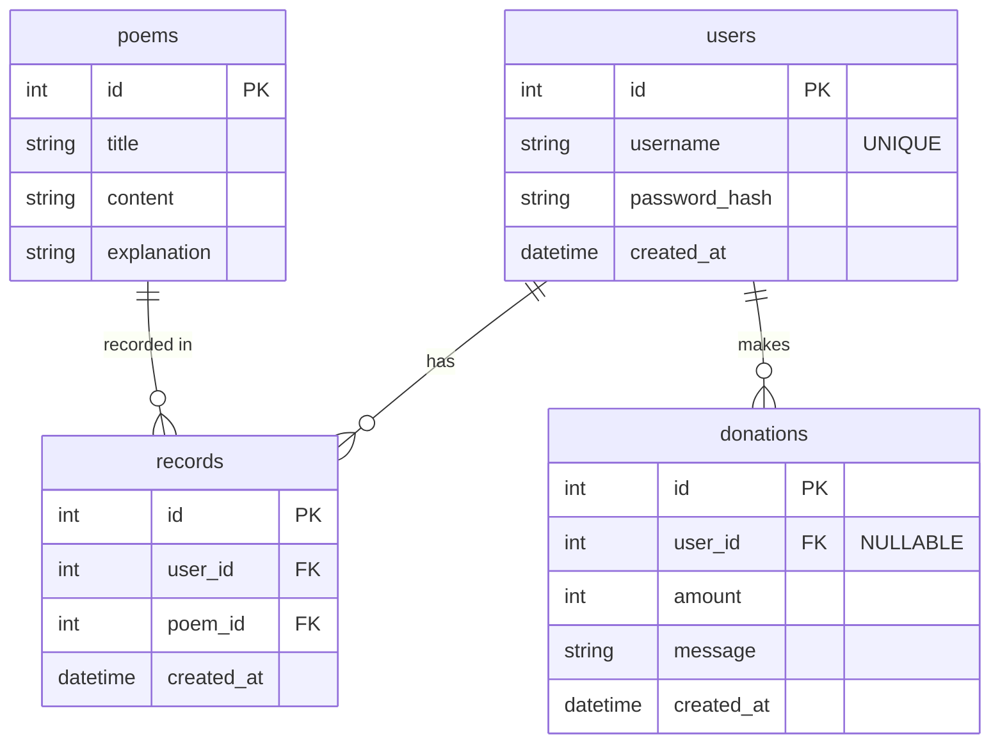

# 資料庫設計文件 (DB Design)

## 1. ER 圖

## 2. 資料表詳細說明

### users (會員資料表)
管理系統會員，包含其雜湊後密碼。
- `id` (INTEGER): PK, 自動遞增。
- `username` (TEXT): 必填，不可重複。
- `password_hash` (TEXT): 必填，雜湊處理後密碼。
- `created_at` (DATETIME): 建立時間。

### poems (籤詩資料庫)
儲存所有預設的籤詩內容與解讀。
- `id` (INTEGER): PK, 籤詩編號，自動遞增。
- `title` (TEXT): 籤詩標題 (例如: 第一籤)。
- `content` (TEXT): 籤詩內容。
- `explanation` (TEXT): 解籤內容。

### records (抽籤紀錄表)
紀錄使用者求籤的歷史紀錄。此表允許未登入使用者求籤 (未來若允許未登入儲存可用 UUID，目前依需求可為匿名或要求登入)。
- `id` (INTEGER): PK，紀錄編號。
- `user_id` (INTEGER): FK，對應 `users.id`。未登入抽籤可設為 NULL。
- `poem_id` (INTEGER): FK，對應 `poems.id`。
- `created_at` (DATETIME): 求籤時間。

### donations (香油錢紀錄表)
紀錄香油錢的模擬捐獻。
- `id` (INTEGER): PK，捐款編號。
- `user_id` (INTEGER): FK，對應 `users.id`。可為 NULL 表示匿名捐款。
- `amount` (INTEGER): 必填，捐款金額。
- `message` (TEXT): 祈福訊息。
- `created_at` (DATETIME): 捐款時間。
