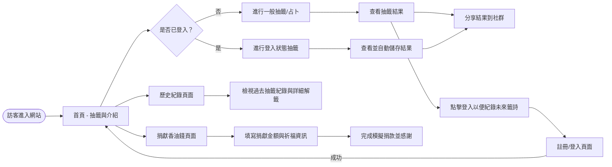
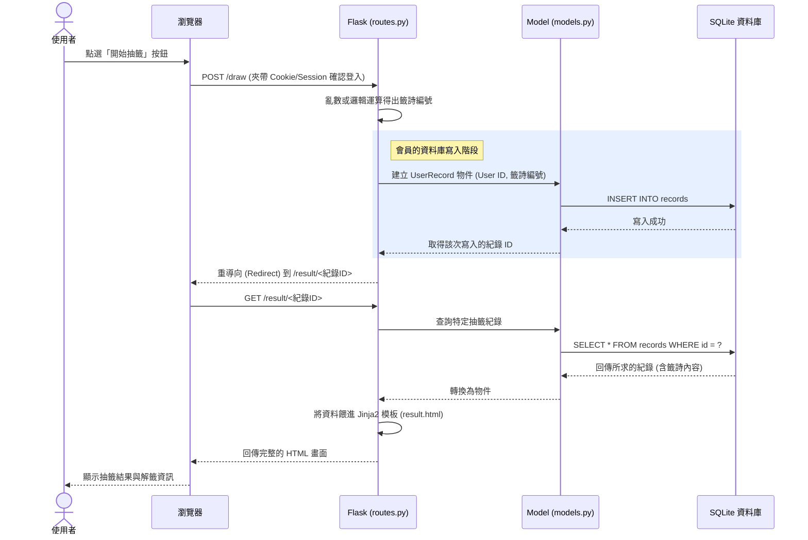

# 流程圖設計 - 線上算命系統

根據產品需求與系統架構設計，本文件將系統操作與資料流視覺化，確保開發團隊對使用者行為的想像一致，並定義出未來將開發的 Web 路由。

---

## 1. 使用者流程圖（User Flow）
此圖描繪了使用者從進入網站開始，可能進入的頁面以及進行的各種操作流程。

---

## 2. 系統序列圖（Sequence Diagram）
此圖以「使用者進行一次抽籤並儲存」作為範例，描述系統底層前端、控制器與資料庫如何互動並傳遞訊息。

---

## 3. 功能清單與路由對照表
整理出主要的頁面與操作，對應未來要實作的 Flask 路由。系統設計符合基本的 REST 風格與表單提交習慣：

| 頁面/功能項目 | HTTP 方法 | URL 路徑 | 功能說明 |
| :--- | :--- | :--- | :--- |
| **首頁與操作入口** | GET | `/` | 介紹系統，並提供開始抽籤的按鈕。 |
| **執行抽籤邏輯** | POST | `/draw` | 負責亂數產生結果、若已登入則寫入資料庫，隨後跳轉。 |
| **檢視單次結果** | GET | `/result/<id>` | 抽籤後展示籤詩與解開的內容，此連結可用來網頁分享。 |
| **註冊頁面** | GET | `/register` | 填寫會員註冊用的表單。 |
| **註冊送出** | POST | `/register` | 接收表單並將新會員存入資料庫。 |
| **登入頁面** | GET | `/login` | 填寫會員登入資訊。 |
| **登入送出** | POST | `/login` | 核對帳號密碼，成功則建立 Session。 |
| **登出** | GET | `/logout` | 清除登入 Session 狀態並導回首頁。 |
| **歷史紀錄列表** | GET | `/history` | (需登入) 從資料庫撈出該會員過往求得的所有籤詩。 |
| **香油錢捐獻頁面** | GET | `/donate` | 顯示捐款表單與模擬付款介紹。 |
| **送出模擬捐獻** | POST | `/donate` | 接收捐款意向，寫入 Donation 資料表作為紀錄。 |
